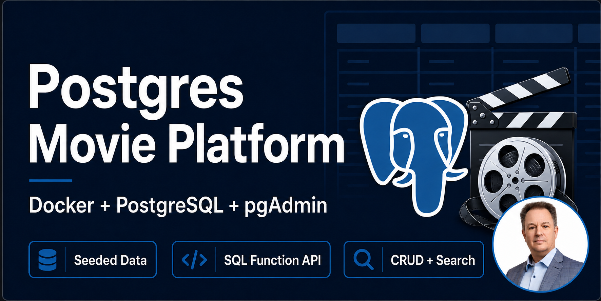
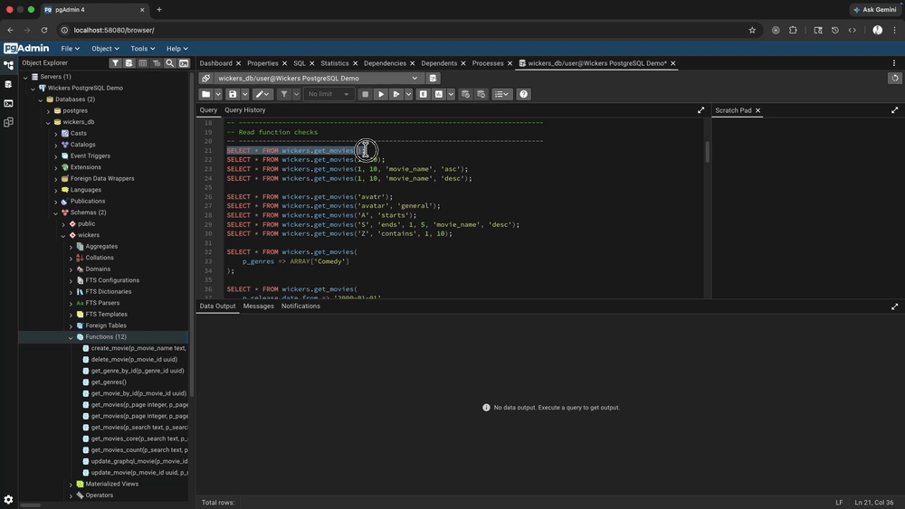
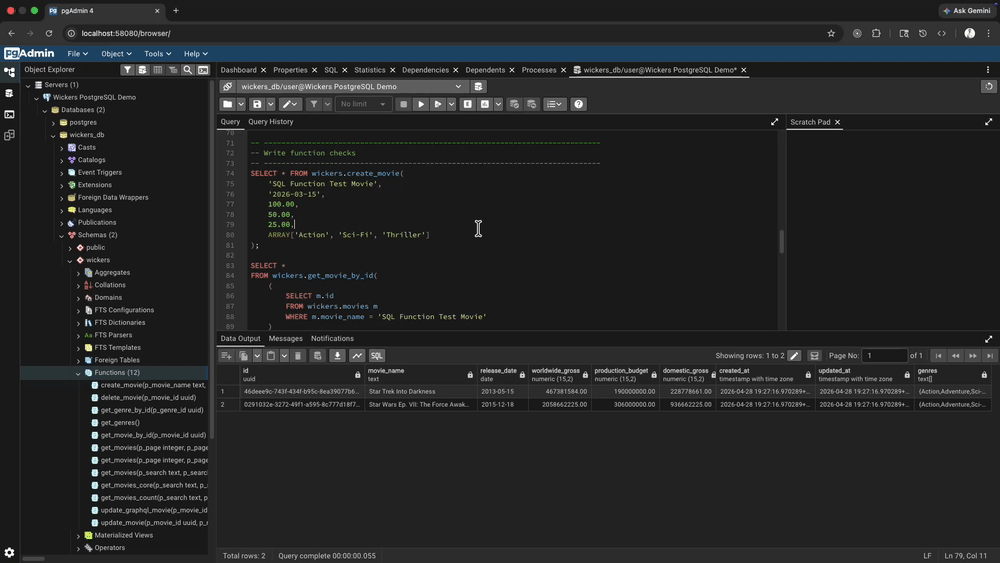
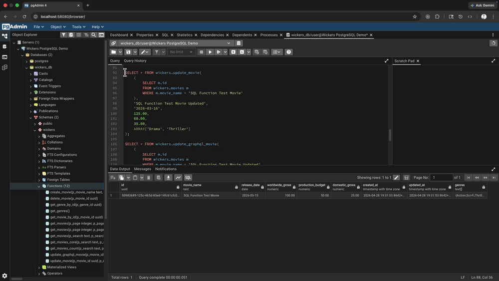
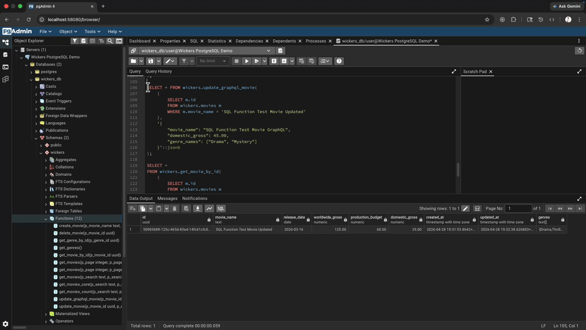
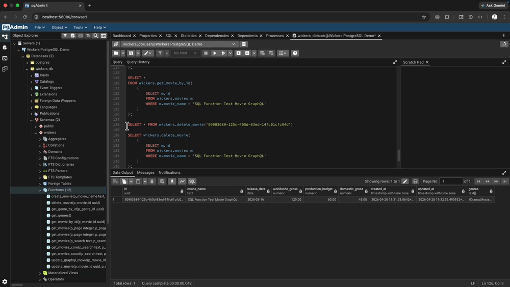
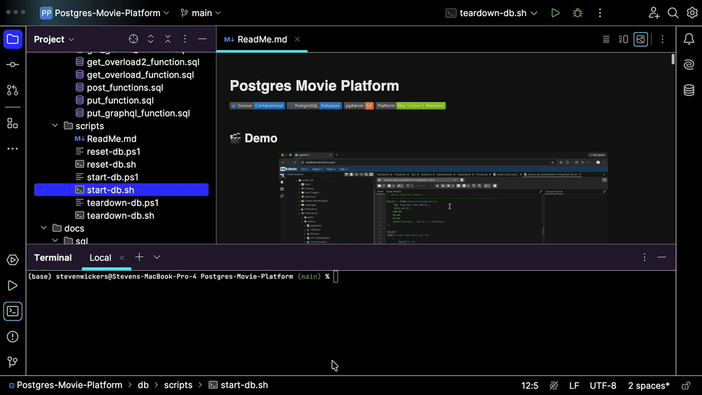
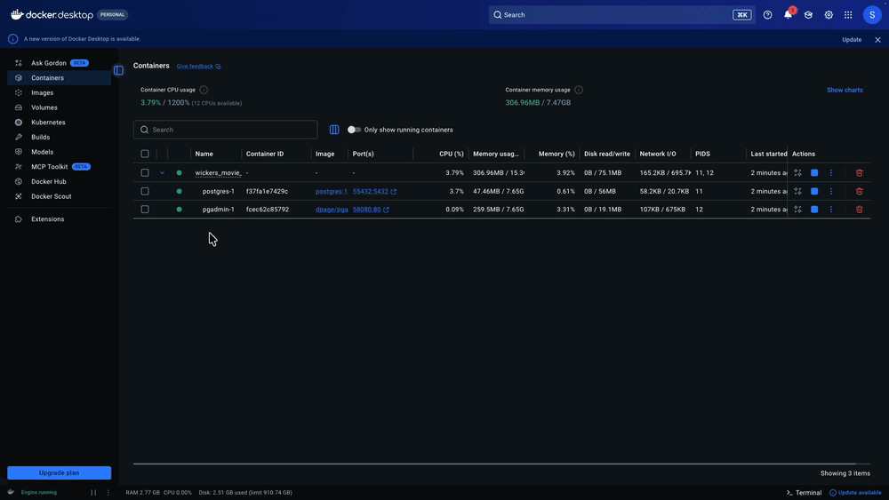
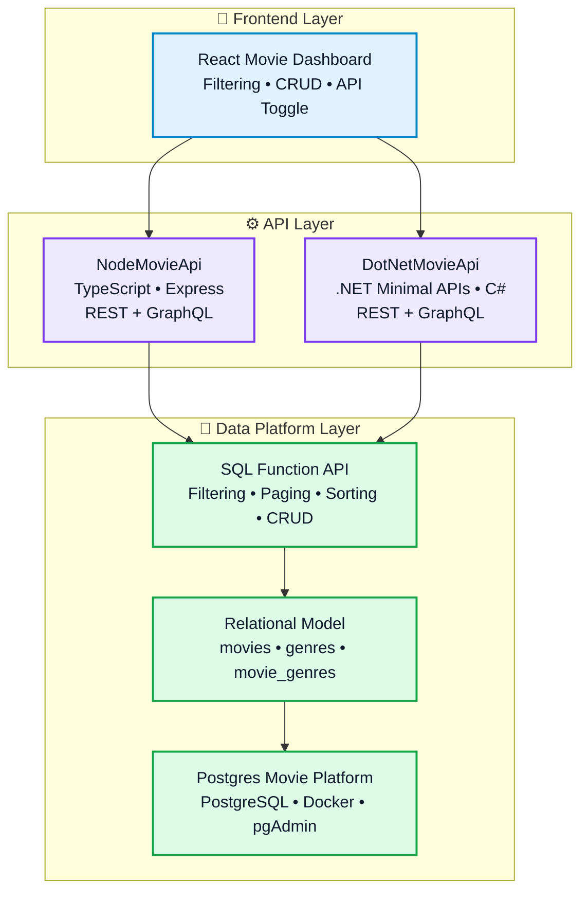

# Postgres Movie Platform

---

## 🎥 Architecture Walkthrough

[](https://www.youtube.com/watch?v=QpMMaJEFxmc&t)

## 🎬 Demo

### 🔍 Fetch Movies



### ✨ Create Movie



### ✏️ Update Movie



### 🩹 Patch Movie



### 🗑️ Delete Movie



### ⚙️ Setup & Docker





---

## ⭐ Key Concept

This project provides the shared PostgreSQL data platform used by both the Node.js and .NET APIs, exposing a function-based SQL layer that supports filtering, paging, and CRUD operations without duplicating logic in application code.


## 🏗️ Platform Architecture



### 💡 Architecture Insight

This platform centralizes data logic in PostgreSQL, allowing both Node.js and .NET APIs to support REST and GraphQL without duplicating filtering, paging, or CRUD logic.

## 🚀 Capabilities

A containerized PostgreSQL data platform that powers both REST and GraphQL APIs, providing a reusable function-based query layer for filtering, paging, and CRUD operations.

It is designed to give you:
- A reproducible local PostgreSQL environment
- Seeded movie and genre data
- A many-to-many relational model (`movies`, `genres`, `movie_genres`)
- A function-based SQL API for reads, filtering, paging, create, update, and delete flows
- A ready-to-use pgAdmin instance for exploring the database visually

## 🧠 Why This Project

This project demonstrates how complex query logic can be centralized in the database using PostgreSQL functions, enabling multiple API implementations (Node and .NET) to share a single source of truth for filtering, paging, and data manipulation.

## 📦 Project Structure

### Infrastructure
- `docker-compose.yml`
  Starts PostgreSQL and pgAdmin.
- `pgadmin/servers.json`
  Preloads the PostgreSQL connection in pgAdmin.

### Database Initialization
- `db/init/01-init.sql`
  Creates extensions, schema, tables, seed data, and the `wickers.movie_row` composite type.
- `db/init/*.sql`
  Creates the function layer used to read and modify movie data.

### Utility Scripts
- `db/scripts/start-db.sh`
- `db/scripts/reset-db.sh`
- `db/scripts/teardown-db.sh`
- `db/scripts/start-db.ps1`
- `db/scripts/reset-db.ps1`
- `db/scripts/teardown-db.ps1`

### Example Queries
- `docs/sql/function_api_smoke_test.sql`
- `docs/sql/search_functions.sql`

## Database Design

### Schema
- `wickers`

### Tables
- `wickers.movies`
  Stores movie metadata including release date and financial metrics.
- `wickers.genres`
  Stores unique genre names.
- `wickers.movie_genres`
  Joins movies to genres in a many-to-many relationship.

### Seed Data
The database is initialized with a movie dataset during first boot. Seed rows include `movie_link` in the table for reference data, but the current create/update API does not expose `movie_link` to the UI/API contract.

## SQL API

The project exposes a database-level API through PostgreSQL functions.

### Read Functions
- `wickers.get_movies()`
- `wickers.get_movies(page, page_size)`
- `wickers.get_movies(page, page_size, sort_by, sort_direction)`
- `wickers.get_movies(...)`
  Supports search, paging, sorting, release date filters, gross/budget filters, and genre filters.
- `wickers.get_movies_count(...)`
  Returns the count for the same filter set used by `get_movies(...)`.
- `wickers.get_movie_by_id(uuid)`
- `wickers.get_genres()`
- `wickers.get_genre_by_id(uuid)`

### Write Functions
- `wickers.create_movie(...)`
- `wickers.update_movie(...)`
- `wickers.delete_movie(uuid)`
- `wickers.update_graphql_movie(uuid, jsonb)`

## Requirements

Before starting, make sure you have:
- Docker Desktop or Docker Engine with `docker compose`
- An available local port `55432` for PostgreSQL
- An available local port `58080` for pgAdmin

## Setup

### 1. Start the database

Mac / Linux:

```bash
./db/scripts/start-db.sh
```

Windows PowerShell:

```powershell
.\db\scripts\start-db.ps1
```

If PowerShell script execution is blocked:

```powershell
powershell -ExecutionPolicy Bypass -File .\db\scripts\start-db.ps1
```

### 2. What startup does

The start script:
- Starts PostgreSQL and pgAdmin with Docker Compose
- Waits for PostgreSQL to become healthy
- Waits for pgAdmin to become reachable
- Prints local connection details

### 3. Access the services

| Service | Value |
| --- | --- |
| pgAdmin | http://localhost:58080 |
| PostgreSQL host | `localhost` |
| PostgreSQL port | `55432` |
| Database | `wickers_db` |
| Username | `user` |
| Password | `password` |

## Using The Database

### Open pgAdmin
After startup, open [http://localhost:58080](http://localhost:58080).

Use:
- Email: `admin@example.com`
- Password: `password`

The PostgreSQL server is preconfigured through `pgadmin/servers.json`.

### Connect from another SQL client

```text
Host: localhost
Port: 55432
Database: wickers_db
User: user
Password: password
Schema: wickers
```

### Run sample queries

You can use the examples in `docs/sql/function_api_smoke_test.sql`.

Examples:

```sql
SELECT * FROM wickers.get_movies();

SELECT * FROM wickers.get_movies(
  p_search => 'avatar',
  p_search_mode => 'general'
);

SELECT * FROM wickers.create_movie(
  'Inception',
  '2010-07-16',
  839000000.00,
  160000000.00,
  292000000.00,
  ARRAY['Action', 'Sci-Fi']
);
```

## Restore / Reset The Database

If you want to rebuild the database from scratch and reload the seed data, use the reset script.

Mac / Linux:

```bash
./db/scripts/reset-db.sh
```

Windows PowerShell:

```powershell
.\db\scripts\reset-db.ps1
```

### What reset does
- Stops the current containers
- Removes this project's Docker volumes
- Recreates PostgreSQL and pgAdmin
- Re-runs all initialization SQL in `db/init`
- Restores the seeded movie dataset

This is the fastest way to return the project to a known-good local state.

## Break Down / Teardown The Database

If you want to stop and fully remove the local environment for this project:

Mac / Linux:

```bash
./db/scripts/teardown-db.sh
```

Windows PowerShell:

```powershell
.\db\scripts\teardown-db.ps1
```

### What teardown does
- Stops the PostgreSQL and pgAdmin containers
- Removes this project's containers
- Removes this project's Docker volumes

After teardown, your seeded data and local database state are gone until you run start or reset again.

## Project Notes

- The Docker Compose project name is `wickers_movie_demo`.
- The SQL API is centered around the `wickers` schema.
- `movie_link` still exists in the base seeded table, but it is not part of the current create/update API contract.
- `get_movies(...)` and `get_movies_count(...)` are intended to stay aligned for paging and filter totals.

## Troubleshooting

### Port already in use
If `55432` or `58080` is already being used by another local service, stop the conflicting service or remap the ports in `docker-compose.yml`.

### Docker is not running
Start Docker Desktop or your local Docker daemon before running any script.

### Clean rebuild needed
If the schema or function definitions drift during development, run the reset script to recreate the environment from scratch.

## 🔗 Related Projects

### 🎬 [DotNetMovieApi](https://www.youtube.com/watch?v=q-9eWAzOLdA){:target="_blank"}
ASP.NET Core Minimal API implementation built on top of the Postgres Movie Platform, exposing shared PostgreSQL functions through REST and GraphQL endpoints.
[Project](https://github.com/stevenwickers/DotNetMovieApi){:target="_blank"}

### ⚡ [NodeMovieApi](https://www.youtube.com/watch?v=GLjxuYa2Ttc){:target="_blank"}
Node.js + TypeScript API implementation using Express and GraphQL Yoga, demonstrating reusable backend architecture and centralized data access patterns.
[Project](https://github.com/stevenwickers/NodeMovieApi){:target="_blank"}

### 🖥 [Movie-UI-Dashboard](https://www.youtube.com/watch?v=0U7bPBvNf9Y){:target="_blank"}
React + TypeScript frontend application showcasing REST and GraphQL integration, advanced filtering, pagination, sorting, and reusable UI architecture.
[Project](https://github.com/stevenwickers/Movie-UI-Dashboard){:target="_blank"}

### 🧠 [DevAssist-AI](https://www.youtube.com/watch?v=m34JRMG6SjQ){:target="_blank"}
Production-minded Retrieval-Augmented Generation (RAG) application using OpenAI embeddings, semantic retrieval, and centralized AI orchestration workflows.
[project](https://github.com/stevenwickers/DevAssist-AI){:target="_blank"}

## 💡 Project Highlights

- Provides a reusable SQL function layer for multiple APIs
- Eliminates duplicated filtering and paging logic across services
- Fully containerized with Docker and pgAdmin
- Designed for reproducible local development environments

## 📬 Contact

* 💼 [LinkedIn](https://www.linkedin.com/in/stevenwickers/){:target="_blank"}
* ▶️ [YouTube](https://www.youtube.com/@StevenWickersEngineering){:target="_blank"}
* 🌐 [Portfolio](https://stevenwickers.com/){:target="_blank"}
* 📧 Email: [stevenwickers@gmail.com](mailto:stevenwickers@gmail.com)

## 👨‍💻 Author

Steven Wickers
Senior Frontend Engineer
React, TypeScript, Node, C#, PostgreSQL, Cloud
